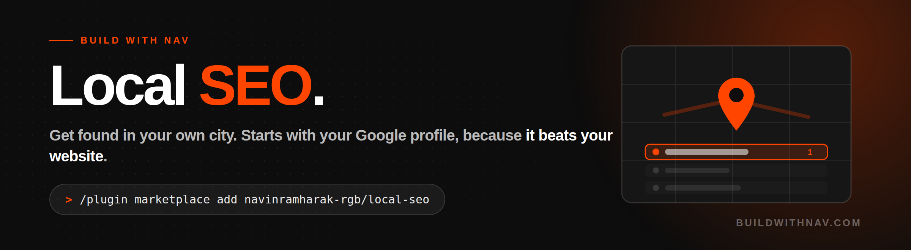

<p>


</p>

**Get found by people searching in your own city.**

For a plumber, a clinic, a law firm, a car wash or a restaurant, your Google Business Profile does more work than your website, and almost nobody ever finishes setting it up. This skill starts there, then works outward.

```
/plugin marketplace add navinramharak-rgb/local-seo
```

Then say: **"I'm not showing up on Google for [what you do] in [your city]"**

---

## The key to this skill

- **Profile before website, every time.** It's free, it takes about an hour, and it moves faster than anything you do to the site. Leading with website work is how agencies bill for six months before anything happens.
- **Category is the whole ballgame.** Your primary category is the strongest single factor in the map results, and it's usually wrong or too generic. A car wash listed as "car detailing service" loses every car wash search in its city, for years, without anyone noticing.
- **Storefront or service area, not both by accident.** If you go to the customer, your address should be hidden. A service-area business showing a home address is a common cause of a suppressed listing.
- **It builds the review machine, not just a nag.** When to ask, the exact text to send, how to reply to the good ones and the bad ones, and a cadence that survives a busy week.
- **It will not build you a review gate.** Screening people before they reach Google breaks Google's policy and can cost you the listing. It says so and gives you the version that works.
- **It tears down the three businesses actually beating you.** Not the one that annoys you, the three in the map pack. Same fourteen fields pulled for all of them and for you, side by side, then the three or four gaps that are a decision rather than a budget. Someone can argue with advice. Nobody argues with "they're in this category and you're not."
- **It scores you out of 100 and shows the working.** Six areas, weighted by what actually moves the map. Most businesses land in the 30s and 40s the first time, which is the point.
- **It takes the before photo.** Five measurements written down and dated, so in thirty days there's something to compare against instead of an argument about feelings.
- **It tells you the truth about rankings.** There's no single position in the map. It changes with where the searcher is standing. Every position it reports says where it was searched from.
- **You get a report, not a chat.** One HTML file: the one thing to do first, the baseline, the competitor table, the score, and a ninety day plan. Opens offline and prints.
- **It never invents a number.** No made-up rankings, search volumes or competitor review counts. It looks it up or tells you it couldn't check.

---

## The order it works in

1. **Google Business Profile.** Free, one hour, where the movement comes from. Category, service area, services, photos, Q&A, posts, attributes.
2. **Reviews.** The strongest local lever that's also a sales asset. Recency matters more than total.
3. **Service and area pages.** One page per thing you want to rank for. One page listing six services ranks for none of them.
4. **Citations.** The dozen that matter, including the Canadian ones most guides skip entirely.
5. **Local schema.** Copy-paste ready, filled in with your real details.

Most people do this list backwards.

## Built for Canada too

Most local SEO advice is written for the US and skips Yellow Pages Canada, Canada411 and 411.ca. For an Edmonton business those are worth more than half the American directories.

## What you get

A plan in four buckets: **today** (free, one hour, the profile), **this week** (reviews turned on), **this month** (pages, citations, schema), and **how to tell it's working** with honest timelines. Profile changes can move in days. Website changes take weeks to months. Anyone promising rankings by Friday is lying to you.

Plus the one thing to do first if you only do one thing. It's nearly always the category.

## Chains with

1. **[Website Audit](https://github.com/navinramharak-rgb/website-audit)**: run this first if you have a website. This skill assumes the site isn't fundamentally broken.
2. **Local SEO** ← you are here.
3. **[50k Website Builder](https://github.com/navinramharak-rgb/50k-website-builder)**: when the audit says rebuild, build it with the service and area page structure already in place rather than retrofitting it later.

For technical SEO beyond local (hreflang, crawl budget, international, programmatic pages), use [Corey Haines' marketing skills](https://github.com/coreyhaines31/marketingskills). That library is excellent and goes far deeper on that axis. This one deliberately covers what it doesn't: the local half.

---

MIT licence. Built by [Build With Nav](https://buildwithnav.com).
